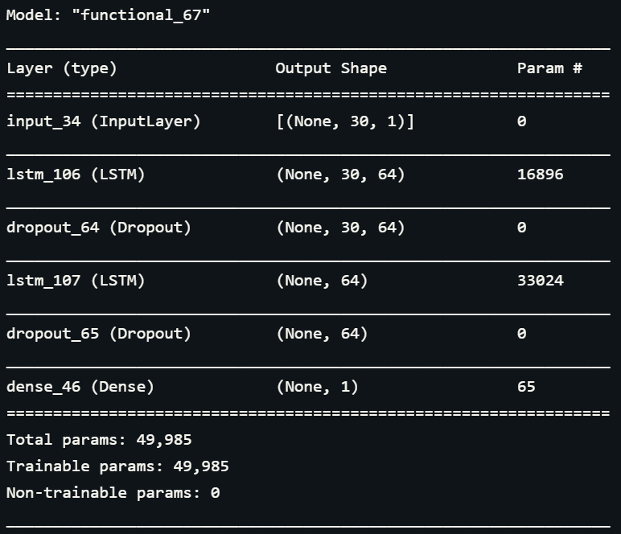
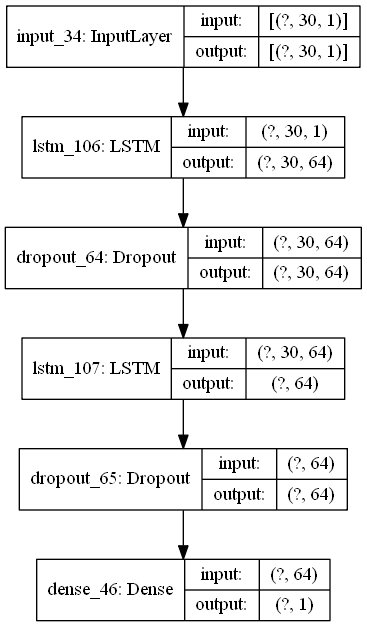
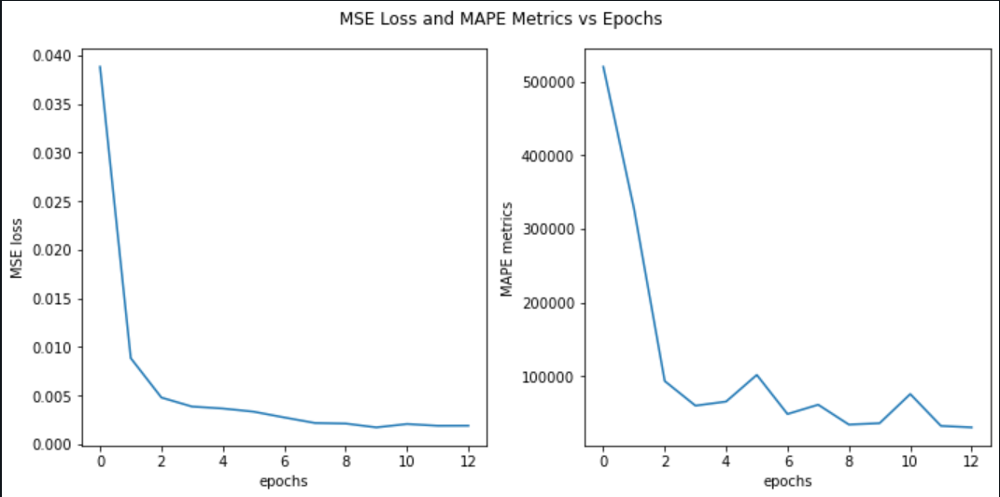
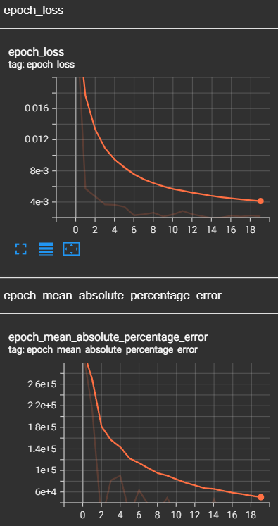
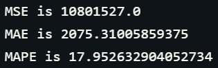
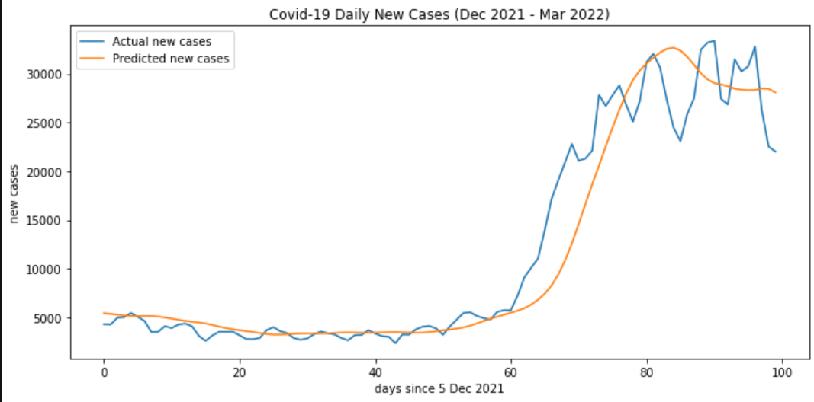

# Project: COVID19 Daily Cases Forecaster

# Description
The project is about developing a deep learning model using LSTM neural networks to forecast/predict the daily cases of COVID19. This is done by training a LSTM deep learning model on the COVID19 daily cases data obtained from [Malaysia Ministry of Health (MOH) COVID19 GitHub Repository](https://github.com/MoH-Malaysia/covid19-public). The main layer of the LSTM deep learning model is the LSTM layer that is inputted with the aforementioned daily cases data, containing nearly 700 daily records.

# How to Install and Run the Project
To run and train the model on your own device, clone the whole repository first. Then, proceed to the directory containing the cloned repository. In this particular directory, locate the `covid_case_predictor.py` file and run this file in your terminal or any of your favorite IDEs. This will generate all the relevant plots and results especially the trained LSTM deep learning model.

# Results
## Neural Network Model Summary & Plot

## Model Training MSE Loss and MAPE Metric
### Matplotlib Plot

### Smoothed Tensorboard Plot

## Model Key Performance Metrics

## Model Predictions

# Credits
- [Malaysia Ministry of Health (MOH) GitHub Repository](https://github.com/MoH-Malaysia/covid19-public)
- [Markdown badges source 1](https://github.com/Ileriayo/markdown-badges)
- [Markdown badges source 2](https://github.com/alexandresanlim/Badges4-README.md-Profile)
